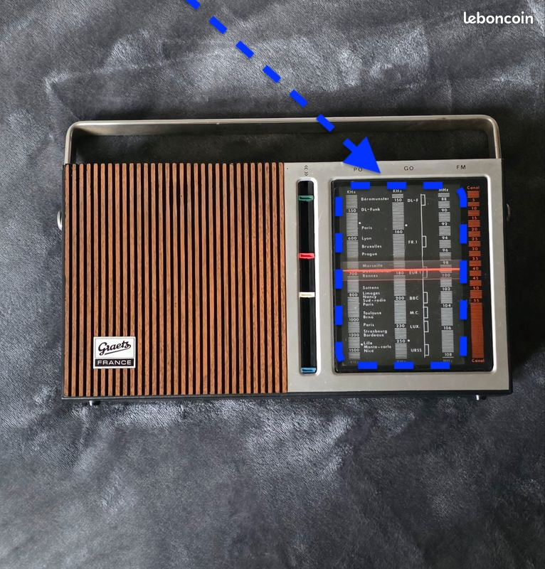

# concept
Embed a screen and system into a decorative object
Internet connection and dynamic display
user can talk?
user can tap?

**features :** 
- clock
- photo-frame
- news
- weather
- [[00003 - web-AI Avatar]]
- ...
# explore
Screen options :
Either some old smartphone, which was jailbreaked  ; rooted
Either some small HDMI screen plugged to a raspberry-ish

Screen goes there (version : vintage radio)

Screen goes here (version : painting)
![[4e2e2ffe-e729-46c2-82b7-8a24235c1495.png]]